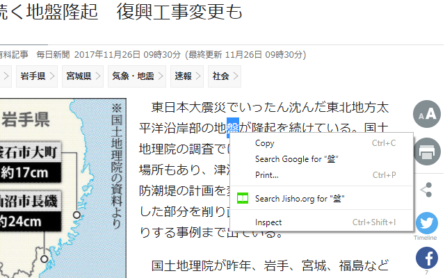

# jisho-extension 
A Chrome extension that makes it slightly more convenient to look up kanji on Jisho.org.

[Here is a link to the extension on the Chrome Web Store.](https://chrome.google.com/webstore/detail/jisho-extension/iblocgbegbfbikfpjajboohgnegaonho)

----

